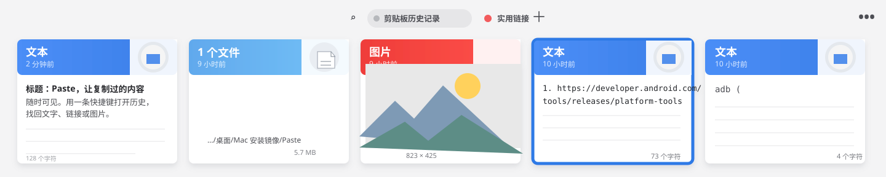
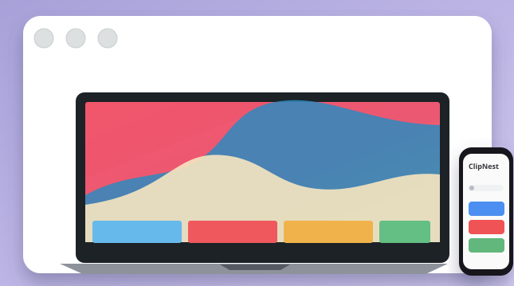
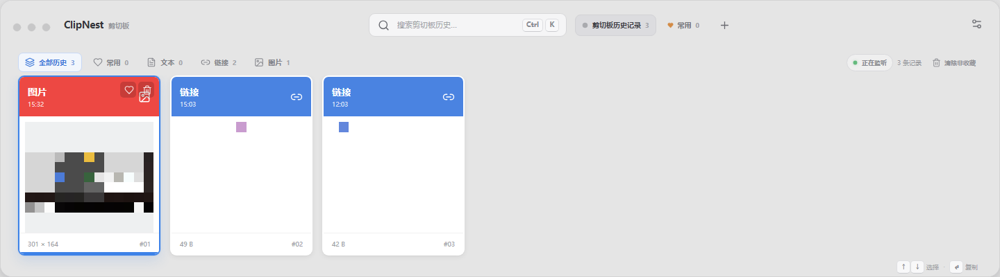

# ClipNest

> 一款面向 Windows 的键盘优先剪切板历史工具，交互参考 macOS Paste。

[下载免安装 ZIP](https://github.com/liu-60/clipnest-windows/releases/latest/download/ClipNest-1.1.3-windows.zip) · [下载 Windows 安装包](https://github.com/liu-60/clipnest-windows/releases/latest/download/ClipNest-Setup-1.1.3.exe) · [软件介绍与下载主页](https://liu-60.github.io/clipnest-windows/)

## 界面设计

ClipNest 采用 Paste 风格的浅灰工作台、顶部搜索和横向卡片流：文本、链接、图片按时间倒排显示，当前选择用蓝色描边突出。

ClipNest 的历史面板默认以底部抽屉打开，宽度占满当前屏幕；卡片保持单行横向平铺，不叠放。窗口、托盘与安装包统一使用简洁的蓝色 **P.** 图标。

## 实机运行截图

> 截图来自 Windows x64 目录包的实际运行窗口。为保护截图中的剪切板隐私，图片、链接等剪切内容已做模糊处理；窗口尺寸、底部抽屉、单行卡片与系统状态均保留。

## 普通用户操作

1. 下载并解压 Windows ZIP，双击 **ClipNest.exe** 启动；或运行安装包完成安装。首次运行会默认设置 Windows 当前用户开机自启，应用会后台常驻系统托盘。
2. 在任意应用中连续按 **Ctrl + C**，复制多条文本、链接或图片。
3. 按 **Ctrl + Shift + V** 打开剪切面板，历史内容会按时间从新到旧排列。
4. 点击想使用的卡片，或用 **↑ / ↓** 选中后按 **Enter**。该条内容会被激活为当前系统剪切板。
5. 回到目标应用按 **Ctrl + V**，即可粘贴刚刚选中的文本、链接或图片。

常用快捷键：

| 操作 | 快捷键 |
| --- | --- |
| 打开 / 关闭剪切面板 | **Ctrl + Shift + V** |
| 聚焦搜索 | **Ctrl + K** |
| 移动选择 | **↑** / **↓** |
| 激活当前内容 | **Enter** |
| 关闭面板 | **Esc** |

面板中还支持搜索、文本/链接/图片筛选、常用标签、删除以及清除非收藏历史。列表使用虚拟滚动，历史数量较多时仍保持流畅。

相同的剪切内容不会重复保存；再次复制时会把已有卡片前置并刷新时间。底部的 **↑ / ↓ 选择 · ↵ 复制** 提示固定在面板上，不会随着卡片横向滚动。

点击面板右上角设置按钮，或从系统托盘右键菜单进入 **设置**，可以集中配置 Windows **开机自启**、历史保存位置、最大保存数量、可选云端存储和版本升级。标记为 **常用** 的剪切内容会显示标签，不会被自动清理，也不能直接删除；取消常用后才可以删除。

开机启动时 ClipNest 会保持后台运行，不会自动弹出面板；按 **Ctrl + Shift + V** 即可呼出。软件托盘和窗口使用简洁的蓝色 **P.** 图标。

## 本地开发与打包

环境要求：Windows、Node.js、pnpm。

~~~powershell
pnpm install
pnpm dev
pnpm lint
pnpm build
pnpm package:windows
~~~

开发窗口会同时启动 Vite 和 Electron。Windows 目录包位于 **release/win-unpacked**，运行其中的 **ClipNest.exe** 即可，无需安装；`pnpm package:windows` 同时生成 NSIS 安装包和目录包。

## 数据与隐私

- 未启用云端同步时，剪切板历史只保存在本机，不上传云端。
- 默认不开启云端同步；在配置页启用后，历史会在本地使用 AES-256-GCM 加密，再按项目令牌同步到云端，服务端只保存密文。不同项目使用不同项目 ID 与令牌，数据目录彼此隔离。
- 云端同步使用项目级令牌鉴权；服务端只保存令牌哈希和密文快照，不保存剪切内容明文。项目令牌保存在 Windows 安全存储中，配置页不会回显完整令牌。
- 数据默认位于 **%APPDATA%/ClipNest/history.json**，也可以在设置页切换到其他文件夹。
- 默认最多保存 100 条历史，可在设置页调整为 20–2000 条；总大小约 25 MB，常用项不会被自动清理。
- 图片内容会以本地 Data URL 形式写入当前保存位置的 **history.json**，不会上传云端。
- 开机自启、保存位置和数量偏好保存在 **%APPDATA%/ClipNest/settings.json**。
- 配置页可以检查 GitHub Release 更新、查看更新说明，并在 Windows 打包版本中下载后重启完成一键升级。

云端存储部署、项目令牌和 Windows 配置步骤见 [云端存储使用文档](docs/cloud-storage.md)；服务器端部署文件位于 [server](server/)。公开仓库不包含真实服务器地址、令牌、密码或 SSH 私钥；请在部署后通过配置页填写自己的云端地址和令牌。

## 说明

如果 Windows SmartScreen 首次拦截未签名程序，请点击“更多信息”后选择“仍要运行”。这是免安装 ZIP 版本，不会写入系统安装器。

## License

MIT
