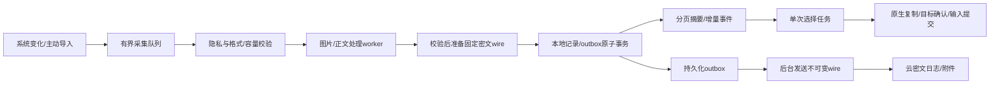

# 02 · 新版技术架构与模块契约

规划状态：待实现。工作目录 `D:\ClipNest-work\v2`；L0 在独立的 `D:\ClipNest-work\electron-l0`。技术决策以00为准，数据/加密以03为准，平台执行以04为准。

## 1. 技术栈冻结

| 范围 | 选择 | 禁止替代方式 |
|---|---|---|
| 桌面 host | Tauri 2；T11 PoC gate，不过则 Electron + 同一 Rust 核心 | 未验证就删旧应用、把移动端塞进桌面 WebView |
| 桌面核心 | Rust、Windows windows-rs、macOS 系统适配；SQLCipher/rusqlite 后台仓储 | 每次 PS/Add-Type、交互线程同步磁盘/网络、巨大 main.rs |
| 桌面/Web UI | React/TypeScript/Vite，TanStack Virtual、共享设计变量与可复用组件 | 全量图片 Base64 列表、手写虚拟列表 |
| 手机 | React Native、Expo development build、expo-sqlite SQLCipher、系统分享入口 | Expo Go 冒充原生验收、后台读其他应用剪贴板承诺 |
| Web 缓存 | Dexie/IndexedDB，检索与加密在 Worker；受浏览器额度限制 | 用 localStorage 保存完整资料/密钥，阻塞主线程全文扫描 |
| 账号 | Better Auth；桌面/手机系统浏览器登录 | 自研密码认证、把 OAuth token 当加密密钥 |
| 服务端 | Node 24 LTS/TS/Fastify、pg、node-pg-migrate、pg-boss | 首发微服务、自研队列、同步读写 JSON 云快照 |
| 云资源 | PostgreSQL 17、私有 S3，单写区域，静态 CDN | 公开附件桶、多主写、账号间内容 hash 去重 |
| 密码基础 | 官方 libsodium 与官方 JS/WASM wrapper；具体格式见03 | 自研算法、更换 nonce/AAD、明文 fallback |
| 工程 | pnpm workspace、Cargo workspace、版本锁、Vitest/Cargo/Playwright/受控真机验收 | npm/yarn 混用、每任务自动升级依赖、无证据绿色状态 |

版本候选见 versions.snapshot.json。T06 必须做兼容验证后锁定；移动端 React/RN 由 Expo SDK 管理，可与 desktop/web 不同。业务与设计变量共享，不强迫两套渲染器共享组件实现。

## 2. 目录与责任

```text
v2/
  apps/
    desktop/src/              React shell、快捷面板、管理窗口
    desktop/src-tauri/        command/capability/window 生命周期；仅 host 适配
    mobile/src/               RN 页面、分享/剪贴板入口与平台仓储适配
    web/src/                  PWA、Worker、浏览器仓储与解锁入口
    server/src/modules/       auth,devices,keys,sync,attachments,billing,usage
    server/src/worker/        pg-boss handlers、回收、对账与通知
    server/migrations/        SQL；node-pg-migrate 编排
  packages/
    contracts/src/            Zod DTO、错误码、limits.v1.json
    contracts/generated/      JSON Schema；禁止直接编辑
    contracts/fixtures/       跨语言协议/密码/同步测试向量
    domain/src/               TS纯规则、查询/同步状态与端能力接口
    crypto-native/            复用官方libsodium的薄绑定、独立Hermes测试壳
    ui-web/src/               desktop/web共享组件，不引用Tauri/API实例
  crates/
    core/src/                 仓储、附件、检索、采集、同步、密码接口
    platform-windows/src/     Windows系统能力，不引用React或云计费
    platform-macos/src/       macOS系统能力与权限降级
    native-helper/src/        L0/独立进程host、请求控制与粘贴worker
    contracts/src/generated/  自动生成DTO；独立边界验证在非generated文件
  fixtures/                   合成数据，不放用户历史
  scripts/                    contracts生成、checks、合成负载与报告
  docs/adr/                   决策/版本与不可逆格式变化
  infra/                      本地compose、容器部署、IaC与环境模板
```

host 不持有“完整历史数组”作为权威仓储。UI 不直接访问 SQLite、文件系统、auth 私钥或 S3。`core` 不依赖 Tauri API，使 Electron/helper/Tauri 复用同一能力边界。

## 3. 契约与跨语言生成

canonical：`packages/contracts/src/*.schema.ts` 的 Zod schema。T06 输出 JSON Schema，再通过锁定 quicktype 生成 Rust DTO；生成器遇 unsupported construct 时只能简化 canonical schema或提交最小ADR，不能分别维护互相矛盾的两套类型。

- 标量统一：UUID字符串；seq/revision/epoch/bytes等 bigint 用十进制字符串；时间为明确 UTC ISO 字符串或契约注明的毫秒值，不能混用。
- JSON Schema 与固定 fixture 用 Ajv/边界校验验证；Rust serde反序列化后检查长度、范围、scope与业务约束。类型正确不等于授权正确。
- 云DTO严格使用`protocol:1`；本地helper使用`v:1`，不可混写。schema默认strict拒绝未知字段；新增字段必须先更新契约与协商/版本策略，不能由某一客户端自行宽松接收。未知协议/必需能力返回 `PROTOCOL_UNSUPPORTED`，不能盲猜。
- 生成结果提交Git；`contracts:check` 重新生成到临时目录并比较，不改工作树。测试fixture必须覆盖>=2^53数值。
- 原生命令控制frame最多64KiB。大正文/图片使用core受控对象引用；任意文件路径不得成为helper输入接口。

Tauri commands冻结入口：`history_query`、`item_read`、`saved_create`、`saved_update`、`collection_mutate`、`history_delete_local`、`cloud_delete`、`copy_or_paste`、`paste_cancel`、`capabilities_get`、`settings_get/update`、`sync_status_get`。全部输入schema验证与发送方/窗口capability限制。

## 4. UI—仓储接口

```ts
interface HistoryQuery {
  requestId: string; generation: string;
  area: 'history' | 'library'; collectionId?: string;
  text: string; kinds: ('text'|'link'|'image')[];
  sourceAppIds: string[]; deviceIds: string[];
  fromUtc?: string; toUtc?: string; cursor?: string;
  limit: number; // <= limits.transport.summaryPageItems
}
interface ItemSummary {
  id: string; kind: 'text'|'link'|'image'; entityKind: 'history'|'saved';
  preview: string; capturedAt?: string; updatedAt: string;
  sourceLabel?: string; deviceLabel?: string; thumbnailRef?: string;
  scope: 'local_only'|'personal_cloud';
  syncState: 'local'|'queued'|'syncing'|'synced'|'blocked'|'conflict';
}
interface QueryPage {
  items: ItemSummary[]; nextCursor?: string; generation: string;
  coverage: { indexedEntities: number; indexedUntilSeq: string;
    cloudHighWaterSeq?: string; complete: boolean };
}
```

`summary` 只能带最长160字符预览与小型字段，不带正文、DataURL、原图或密钥。响应也受128KiB上限约束，达到字节预算时提前截页并返回游标；不能截断单项为非法JSON。

`item_read(id)` 返回正文描述/受控附件引用；复制时core读取实际正文。事件仅发送 `{eventId, entityIds, changeKind}` 或简要patch，单批合并；不得广播完整数据集。跨账号切换销毁旧订阅与query generation。

## 5. 本地实体与搜索语义

HistoryEntry是不可变采集快照。SavedItem是新身份的可编辑资料。Collection/CollectionEntry独立管理关系；Unpin不删除正文。正文大于16KiB的加密manifest预算时走body attachment，2MiB文字上限不意味着每条都嵌入sync JSON。

canonical明文payload也由contracts冻结，服务器不能解密校验，由客户端边界/跨端fixture校验：

```ts
type BodyV1 =
 | { kind:'text'|'link'; storage:'inline'; text:string }
 | { kind:'text'|'link'; storage:'blob'; attachmentId:string }
 | { kind:'image'; originalId:string; thumbnailId:string;
     mime:'image/png'|'image/jpeg'|'image/webp'; width:number; height:number };
type PayloadIdentityV1 = {
  protocol:1; entityId:string; versionId:string; revision:string; // canonical Decimal
  attachments:{attachmentId:string; purpose:'text_body'|'image_original'|'image_thumb'|'ocr_body';
    kid:string; keyVersion:string; nonce:string; cipherBytes:string; cipherSha256:string}[];
};
type PayloadV1 = PayloadIdentityV1 & (
 | { entityKind:'history'; body:BodyV1; capturedAt:string;
     source?:{deviceId:string; appId?:string; appLabel?:string} }
 | { entityKind:'saved'; body:BodyV1; title:string; tags:string[];
     createdAt:string; updatedAt:string; originHistoryId?:string }
 | { entityKind:'collection'; name:string;
     color:'blue'|'green'|'amber'|'rose'|'slate'; createdAt:string; updatedAt:string }
 | { entityKind:'collection_entry'; collectionId:string;
     savedId:string; addedAt:string });
```

PayloadIdentityV1的ID/revision必须逐字段等于03的加密头，附件描述也被正文AEAD保护：集合/关系attachments=[]；inline文本=[]；blob正文精确一个text_body；image精确image_original+image_thumb。描述ID集合等于routing.attachmentIds，purpose唯一。下载DTO只核对attachmentId/cipherBytes/cipherSha256及实际下载字节的长度/hash；purpose/kid/keyVersion/nonce取自已通过manifest AEAD认证的payload描述，按03构造blob AAD并验证AEAD，不自行给下载DTO添加字段。nonce/hash为03规定的Base64Url，bytes/keyVersion为canonical Decimal，最多4个。ocr_body仅协议保留，首发禁用；未知/重复/多余引用拒绝，不猜测。

字段严格、UTC ISO日期、文本按UTF8限额，名称/标签长度来自limits；title沿用maxCollectionNameUtf8Bytes预算。原正文复制不做NFKC/大小写归一化，只有查询与索引归一化。raw文字<=inlineTextCandidateUtf8Bytes只是inline候选，还必须测实际序列化密文manifest/wire大小；超预算转text_body blob。图片原件不覆盖成thumb，引用purpose与附件集合须一致。客户端解密后核对payload entityKind/ID引用与AAD/服务端projection；不匹配隔离并报错误，不能渲染猜测字段。

首发排序仅最近更新/名称字典序，关系按SavedItem更新时间与ID稳定排序；不做拖拽手动排序/分数序号。后续排序协议另立任务，避免不同端各自发明position字段。

检索正确性先于性能：Unicode NFKC归一化、大小写不敏感、中文1/2/3字与子串匹配、标签/类型/来源/时间/设备组合过滤。排序固定 `(capturedAt或updatedAt DESC,id DESC)`，游标包含排序值与查询指纹；查询变化旧游标失效。

桌面SQLCipher数据库在专用线程查询，FTS5作为加速；短于3字符、tokenizer无法保持子串语义时走明确fallback。不能只搜第一页，不能只按词命中而漏掉规范要求的子串。Web Worker处理已缓存解锁资料，必须报告coverage；索引超预算先停止补索引并告知范围，不静默声称全部已搜索。T10/T20以固定数据集验证；若加速候选不支持语义，保持正确fallback并提交性能报告。

## 6. 线程、队列与故障边界



UI/event loop只做调度和轻量校验；数据库单writer；图片worker1；传输各2；paste单job；队列/字节默认见limits。capture queue满时允许合并同一最新sequence并记录overflow计数，不能静默承诺每次瞬态复制都永久保存。异步delay-rendered clipboard读失败有界重试；最新sequence变化取消旧读取。

首发桌面/手机本地原件、正文和缩略图存SQLCipher受控BLOB对象表，与记录/outbox同库事务管理；对象引用仍与摘要分离，读解码在worker，不跨UI传全量内容。暂不设计第二套本机附件密码封装。云传输准备产生的staging文件已经是03规定的密文；独立明文原图/缩略图文件不得落盘。若T07负载验证证明BLOB不满足预算，先提交受审查的加密文件适配与迁移方案，执行模型不能自行落回明文文件。

采集隐私规则在落盘、预览、OCR、上传之前执行。排除应用/暂停/敏感格式不入库，不先存后隐藏。来源未知时不假称已排除所有密码；可显示明确边界。

超容量先淘汰可淘汰本机历史/附件缓存；收藏、离线固定、pending mutation、未上传附件受保护。仍超限拒绝新增并给清理/导出入口，不能无限吃盘。outbox事务满时同步范围修改不能假成功；本地-only采集可继续受本机预算限制。

## 7. 平台capabilities

```ts
interface Capabilities {
  backgroundCapture: boolean; globalShortcut: boolean;
  clipboardText: boolean; clipboardImage: boolean;
  autoPaste: boolean; shareImport: boolean; startup: boolean;
  status: 'ready'|'permission_required'|'unsupported'|'temporarily_unavailable';
  reasonCode?: string;
}
```

Win验证常规目标与更高权限降级；mac自动粘贴需辅助功能权限；Android普通App不能后台读其他App剪贴板；iOS采用系统粘贴/分享入口；Web按HTTPS、焦点、用户操作与浏览器权限提供复制。UI按capabilities显示，不通过OS名称硬编码成功。

账号状态 `anonymous/authenticated`、云解锁状态 `locked/unlocked`、本机vault可用性、网络 `online/offline`、sync `off/idle/running/blocked/error` 独立组合。未解锁不能展示personal_cloud正文；匿名local_only由本机vault开启。Web匿名/local_only只会话内存<=32MiB，不持久明文；IndexedDB只云密文与加密draft，刷新后云key需重新解锁。离线不阻止已缓存且已解锁的资料。

lock是backend访问边界：history_query/item_read/helper对象注册对personal_cloud的正文、预览、缩图与来源检索字段都拒绝/遮蔽，不能仅React隐藏。ScopeContext取自可信host会话，renderer不能提交cloudUnlocked=true自证。云locked期间禁止cloud范围修改；匿名本机采集仍可写local_only，解锁后明确选择导入才上传，不自动补传。链接首发只作纯文本，不自动网络抓标题/网页预览。

## 8. 工程脚本与环境

T06需实现这些根脚本，后续任务只调用，不各造一套命令：

| 命令 | 用途 |
|---|---|
| `pnpm contracts:generate` / `pnpm contracts:check` | 生成/无副作用检查 |
| `pnpm -r typecheck` / `pnpm -r lint` | 各JS/TS包；lint与类型检查分开 |
| `pnpm --filter @clipnest/<app> test <scope>` | Vitest/对应app针对性用例 |
| `pnpm fixtures:generate -- --profile 10000-text` | 确定seed的合成数据 |
| `pnpm test:integration -- --suite sync` | 隔离PG/S3环境故障注入 |
| `pnpm test:e2e -- --project web` | 浏览器任务流程 |
| `cargo test --workspace` / `cargo clippy --workspace -- -D warnings` | Rust逻辑与边界 |
| `pnpm bench:desktop -- --profile test` | 受控真机测量，默认只读/不注入输入 |

`.env.example`仅字段名和无秘密测试值；生产密钥来自Secret Manager/环境注入。dev/test/staging/prod数据库、桶、应用ID、快捷键和回调URL独立。CI先合成单元/契约，再集成，最后平台签名构建；iOS只在原生能力变化或release gate完整构建，减少XcodeBuild。

## 9. 可复用组件与审查

成熟度初筛见versions.snapshot.json；新增库安装前记录repo stars、最近实际更新/稳定release、license与兼容性。pg-boss与node-pg-migrate已在2026-10-02达到门槛，复用其调度/迁移，不自己写通用框架。[pg-boss](https://github.com/timgit/pg-boss)、[node-pg-migrate](https://github.com/salsita/node-pg-migrate)、[Tauri进程模型](https://v2.tauri.app/concept/process-model/)。

关键边界由独立agent审查：平台输入、迁移、加密、RLS、同步游标、附件账本、billing。审查是实现质量gate，不替代用户对真实数据/生产发布的授权。当前规划不创建云资源，不执行生产发布。
