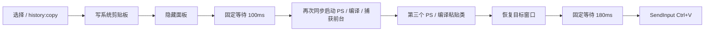

# ClipNest 唤醒与粘贴延迟定位

日期：2026-10-02。对象：本机安装的 ClipNest 1.1.4，Windows。结论来自安装包代码、公开源码、只读组件基准和多 agent 对抗审查。

**优先修复反复启动 PowerShell 与运行时编译的交互链路。保留现有 Electron，即可先消除明显的秒级必经成本。** 框架迁移属于后续产品演进，不是此次提速的前置条件。

## 1. 已测到什么

复核时重新解包当前 `D:\ClipNest\resources\app.asar`。其 main.js 与最初分析文件 SHA256 一致：`c0b5766dd6272a92e9b6e4c0a0097b7e8aeee46e37a0d5e1314224fcf8162928`。

| 独立组件 | 样本 | 中位数 | 最小—最大 |
|---|---:|---:|---:|
| 新 PowerShell，仅执行 exit | 7 | 909.715ms | 880.755—1040.633ms |
| 当前完整前台窗口捕获脚本，spawnSync 启动到退出 | 7 | **1628.295ms** | 1581.167—1663.140ms |
| 当前粘贴 C# 类，仅启动和 Add-Type 编译，到 READY | 7 | **1304.160ms** | 1295.557—1334.082ms |
| 常驻 PowerShell，首个只读查询往返 | 1 | 28.272ms | 单次，不代表分布 |
| 常驻 PowerShell，后续前台窗口查询 IPC 往返 | 29 | **0.118ms** | 0.055—0.350ms |

常驻助手本身初始化到 READY 本次为 1244.044ms；这些成本应在应用启动时支付。重复请求的小样本结果支持“移除每次启动和编译”，不能用来承诺整体粘贴只有 0.118ms。

方法与边界：

- Node v24.16.0；新进程三种样本按轮次交错、顺序执行，避免人为并发制造争抢。“新进程”不代表清空 OS 文件缓存。
- 捕获脚本与安装包相同，使用相同 PowerShell 参数、UTF-16LE EncodedCommand、windowsHide，并验证输出是数字窗口句柄。
- 粘贴基准截断在 C# here-string 结束处，**未调用 RestoreAndPaste、窗口恢复、SendInput，也未读取或写入剪贴板**。
- 编译基准设置 ErrorActionPreference=Stop，屏蔽无关 progress，确认类型确实存在，再输出 READY。READY 包含编译与管道传输，不能等同于 SendInput 完成。
- 常驻助手仅编译一次，使用 stdin/stdout 做真实往返查询；输出窗口句柄没有写入结果文件。
- JSON 中的 sampleP95 是小样本描述，7 个样本的该值就是最大值，不能冒充生产端到端 P95。
- 没有测量真实目标应用接收粘贴的时间，也没有自动触发用户的热键、点击、焦点或输入。

原始结果：[windows-helper-benchmark.json](../evidence/T00/windows-helper-benchmark.json)。只读复现脚本：[benchmark-windows-helper.cjs](benchmark-windows-helper.cjs)。

```powershell
node 'docs/spec/benchmark-windows-helper.cjs' 'src/main/main.ts' 'docs/evidence/T00/windows-helper-benchmark.json'
```

## 2. 唤醒为何慢

当前隐藏窗口唤醒的顺序是：


`showPanel()` 在 `show()` **之前**调用 `capturePreviousWindowHandle()`。所以获取 HWND 的整个 1.63s 级组件成本处在窗口展示的必经路径上，并且同步阻塞 Electron 主进程。此时快捷键、IPC、轮询、窗口动画计时器都不能正常向前执行。

安装包证据：[前台捕获](../../src/main/main.ts)、[展示顺序](../../src/main/main.ts)。对应公开源码：[main.ts](https://github.com/liu-60/clipnest-windows/blob/91cafd765b9480e011647c9d8cd2976269f12aef/src/main/main.ts#L1464)。

窗口一直保留，隐藏没有销毁 renderer；每次唤醒不是重新加载整个 React 应用。150ms 动画从 `show()` 之后开始，不应直接加到首次展示前的阻塞成本里。但每 16ms 从主进程 setBounds 移动原生窗口，在主进程被阻塞时会跳帧；可作为次级优化改成一次定位与内容层动画。

## 3. 选择后粘贴为何慢

当前普通文本、目标 HWND 非零时的顺序：



完整“隐藏后打开 → 选择粘贴”启动 **3 个新 PowerShell，执行 3 次 Add-Type，其中 2 次同步阻塞主进程**。

正常粘贴分支的固定等待是 **280ms**。用本次组件中位数做预算相加：`1628.295 + 1304.160 + 100 + 180 ≈ 3212ms`。也就是说，选择后约有 **3.2s 的启动、编译与固定等待预算**，尚未计入剪贴板处理、焦点 API、首次方法 JIT 和目标应用处理。这是成本估算，**不是实测端到端耗时、端到端中位数或保证下界**。

安装包证据：[选择 handler](../../src/main/main.ts)、[100ms 与再次捕获](../../src/main/main.ts)、[助手进程](../../src/main/main.ts)、[180ms 等待](../../src/main/main.ts)。

图片还会在隐藏之前执行 `createFromDataURL → clipboard.writeImage → toPNG → Base64 → SHA256`。因此图片不仅目标应用出现内容较晚，面板本身也可能较晚消失。文字、图片共用之后的慢路径。

`history:copy` 没有等待实际输入提交：它安排后续任务就返回。renderer 的“已复制”可以说明剪贴板写入，不能说明目标已经消费 Ctrl+V。[Electron invoke 契约](https://www.electronjs.org/docs/latest/api/ipc-main)。

## 4. 需要同步修复的交互与竞态

| 问题 | 证据 | 影响与改法 |
|---|---|---|
| 搜索框焦点拦截方向键 / Enter | [App.tsx:263](../../src/renderer/App.tsx)、[299](../../src/renderer/App.tsx) | 唤醒自动 focus 搜索框，键盘 handler 却对所有 INPUT/TEXTAREA 返回。为搜索输入定义 Down/Enter 进入结果的行为；中文输入法 composition 期间不触发粘贴。 |
| 单击与双击都执行复制 | [App.tsx:544](../../src/renderer/App.tsx) | 若完整 click→click→dblclick 到达，可提交多次；首击隐藏后不保证后续到达。统一一次执行语义，忽略重复 Enter、进行中的重复选择。 |
| 旧粘贴任务无法取消 | pasteIntoPreviousWindow 的 timer 未保存，helper 无 ACK/期限 | 快速重新打开或再次选择，旧任务仍可能抢焦点，多个 helper 共用最新系统剪贴板。使用 generation 与串行状态机；输入提交后不能撤销。 |
| 100ms 后改用任意非自身前台 HWND | main.js:1287 | 原目标会被新应用替换。保存显示前的目标身份，用户切换应用则取消自动注入、保留已复制内容。 |
| 无焦点完成确认 | WINDOWS_PASTE_SCRIPT | 忽略恢复 API 返回，sleep 后直接 SendInput。确认目标实际在前台后才发输入，超时给明确结果。 |
| 无条件 SW_RESTORE | RestoreWindow 的 ShowWindowAsync(target,9) | 会恢复已最大化或排列窗口的原尺寸；仅窗口最小化时恢复。[官方 ShowWindow](https://learn.microsoft.com/en-us/windows/win32/api/winuser/nf-winuser-showwindow)。 |

## 5. 高效修复策略与顺序

### P0：从交互路径删除进程启动和运行时编译

**保持 Electron + React，增加一个随应用启动的常驻、预编译 Windows 原生 helper。** 热路径使用现有 helper 的轻量 IPC；纯查询和剪贴板事件注册也可通过 Node-API 薄适配调用。不要仅把 spawnSync 换成 spawn：这能解除主进程阻塞，却仍留下每次启动与编译的 1s 级等待。

建议正式方案使用 **Rust + Microsoft windows-rs** 封装必要 Win32 API；后续迁移 Tauri 时可把同一平台模块嵌入 Rust 核心。熟悉 C++ 的团队可以使用 node-addon-api，涉及焦点的工作仍应隔离到专用线程或 helper，避免慢目标窗口阻塞 Electron 主线程。

短期验证可以把当前 PowerShell 改为启动一次、编译一次的驻留助手；它保留额外运行时与内存成本，适合作为过渡方案。必须在首次交互前完成 READY 与无副作用的查询预热。本次首个查询 28ms 说明“常驻”也仍有首请求成本；预热不得通过真实输入注入完成。

基于 2026-10-02 GitHub API 现场核验，满足用户的 >=1000⭐、半年内更新要求：

| 可复用基础 | Stars | 最近仓库 push | 用途 |
|---|---:|---|---|
| [windows-rs](https://github.com/microsoft/windows-rs) | 12,786 | 2026-10-02 | 推荐的 Windows API 类型与绑定 |
| [node-addon-api](https://github.com/nodejs/node-addon-api) | 2,409 | 2026-09-02 | C++ Node-API 桥接替代方案 |
| [napi-rs](https://github.com/napi-rs/napi-rs) | 7,958 | 2026-10-02 | Rust Node-API 桥接替代方案 |
| [RobotJS](https://github.com/octalmage/robotjs) | 12,775 | 2026-10-01 | 输入能力可复用，但不能单独完成目标身份、前台确认和剪贴板监听 |

这是复用成熟绑定加产品所需薄适配，不重写输入框架或通用 FFI。预编译并随应用发布 x64/arm64 文件，版本协议可协商；开发依赖用 pnpm 管理。

helper 初始化、编译、崩溃重启均离开交互路径。未 READY 时保持复制能力并报告自动粘贴暂不可用，不能重新落回同步启动 PS。限定请求大小、响应超时、日志长度；队列最多保留一个可执行粘贴任务，避免积压。

### P0：一次粘贴是一项有结果、可取消的任务

推荐顺序：

1. 热键时在显示面板前采集目标 HWND + PID，必要时记录进程创建时间，并排除本应用窗口；generation 匹配才继续展示。快速原生查询可直接执行，跨进程查询异步等待不能阻塞主进程。
2. 点击 / Enter 只提交一个 selection job；进行中防重。写入剪贴板后记录 sequence number，若等待期间被外部改写则停止自动输入。
3. Electron 当前为前台时，若需要独立 helper 恢复焦点，按 Windows 前台规则授权 helper，再隐藏面板；授权会失效，因此仍需验证恢复结果。[AllowSetForegroundWindow](https://learn.microsoft.com/en-us/windows/win32/api/winuser/nf-winuser-allowsetforegroundwindow)。
4. 已在原目标前台时直接继续；否则仅恢复保存的有效目标，并在短期限内确认前台。用户切换到其他应用、目标失效或 generation 变化则取消。helper 在等待期间必须继续接收 cancel，不能只由 Electron 丢弃旧 ACK；取消 ACK 区分 cancelled 与 input-already-submitted。取消的边界必须覆盖助手内部准备发送输入之前。
5. 检查 Ctrl/Shift/Alt/Win 等修饰键状态，有界等待用户释放。焦点与修饰键满足时立即发送一次 Ctrl+V，替换固定 100+180ms 睡眠。
6. 全部等待结束后、SendInput 前再次检查 generation、目标身份和 clipboard sequence；自身写入与取得该次 sequence 尽量处于同一原生临界区，避免把外部更新误记为自身写入。检查 SendInput 返回事件数，通过 ACK 返回 `input-submitted / target-invalid / focus-denied / modifier-held / clipboard-changed / cancelled / input-rejected`。失败不主动覆写当前剪贴板；外部改写时提示重新选择，不覆盖用户刚复制的内容，也不对未知目标盲目重试。

Windows 限制不能用减少 sleep 绕过：SetForegroundWindow 可能被拒绝，跨输入队列的激活可能异步；AttachThreadInput 可能把无响应窗口的影响传给调用方。避免照搬现有强制焦点组合。[SetForegroundWindow](https://learn.microsoft.com/en-us/windows/win32/api/winuser/nf-winuser-setforegroundwindow)、[Microsoft 的异步激活说明](https://devblogs.microsoft.com/oldnewthing/20161118-00/?p=94745)。

SendInput 成功只说明事件插入，不说明目标已完成粘贴；它受完整性级别限制，而且已有按键状态会干扰输入。普通进程无法可靠粘贴到更高完整性级别目标。记录失败，不把 GetLastError 当作 UIPI 的可靠识别器。[SendInput 官方文档](https://learn.microsoft.com/en-us/windows/win32/api/winuser/nf-winuser-sendinput)。

### P1：减少点击后的图片工作，修复键盘与重复触发

- 原生图片对象 / 解码结果做有上限的缓存，例如先限制总解码占用 32MiB，并根据真实内存监控调整；优先准备当前可见项。点击路径保留一次必要剪贴板写入，删除仅为防重复采集执行的 PNG/Base64/hash。
- 自身写入用 clipboard sequence 识别；不要直接假定历史 DataURL 的 hash 等于重新编码后剪贴板图像的 hash，尤其 JPEG 与 PNG 会不同。
- 搜索框支持导航和执行，处理 composition；统一单击或双击执行语义，禁止重复提交，错误有反馈。
- 唤醒时明确选择与滚动的一致性：重置选择到首条，或保留选择并滚到该条，不能只重置滚动。
- 主进程一次设置最终 bounds；动画放在内容层 transform / opacity。先测首帧，不把动画时长当所有延迟的原因。

### P2：降低后台工作对主进程的竞争

目前每 450ms 读取剪贴板，图片没有变化也先编码再比较签名。使用 AddClipboardFormatListener / WM_CLIPBOARDUPDATE；先检查 GetClipboardSequenceNumber，再读取变化内容，合并重复通知并有界重试。原生注册可连接 Electron hookWindowMessage，或由 helper 自己维护消息窗口。[官方剪贴板通知](https://learn.microsoft.com/en-us/windows/win32/api/winuser/nf-winuser-addclipboardformatlistener)、[sequence API](https://learn.microsoft.com/en-us/windows/win32/api/winuser/nf-winuser-getclipboardsequencenumber)、[Electron BrowserWindow](https://www.electronjs.org/docs/latest/api/browser-window)。

图片转换、持久化 JSON、云快照 PBKDF2/加密离开交互主线程。保存使用串行异步写与原子替换，合并更新时明确可接受的未落盘窗口；后续数据库迁移再使用 SQLite worker。云同步不成为选择粘贴的等待条件。

renderer 已使用 TanStack Virtual，不是所有卡片都挂在 DOM 的问题。先处理空查询不扫描正文、增量元数据事件与图片内容分离，再稳定虚拟列表 key callback、减少可见卡片重渲染。全量 JSON/Base64 IPC、正文 lowercase 与同步后台工作是二级负载；没有证据把它们当成当前秒级主因。

只读容量抽样：默认用户目录磁盘历史 52 条、4 张图片、约 526KB；设置约 749KB、114 条 tombstone、云同步配置为开启。抽样 5.03s 内主进程累计 CPU 没有增加。这不排除交互时突发负载，也不证明内存历史与磁盘完全相同；不宜据此把问题归因于“大量卡片”或“CPU 始终满载”。本报告与基准未导出剪贴板正文、图片、云密钥或 token。

## 6. 怎样验收

埋点使用单调时钟；跨进程用 requestId 对齐，各进程报告自身阶段持续时间，避免直接相减未经校准的时钟。只记录耗时、类型、数量和结果码。

| 流程 | 必须分开记录的阶段 |
|---|---|
| 唤醒 | hotkey_received → target_captured → show_requested → renderer_first_frame → list_actionable |
| 粘贴 | selection_received → clipboard_written → panel_hidden → target_active → modifiers_released → input_submitted |
| 目标应用 | 在受控编辑器里另外观测内容实际出现；不要用 IPC 返回代替 |

建议先以预热后的普通文本场景验收：唤醒到可操作 P95 <100ms，选择到输入提交 P95 <150ms。**这些是待验证目标，不是本次已经实现的数字**。恢复焦点或用户一直按住修饰键的场景单独统计超时与失败，不混入“正常快路径”后掩盖问题。

每种正常场景至少 100 次，覆盖鼠标选择、键盘选择、1KB/大文本、图片缓存命中/未命中、显示器切换、连续重开、剪贴板外部变更、目标被关闭、最小化/最大化和更高权限目标。焦点失败、取消、重复输入、输入发往错误窗口需单独审查。

P0 最重要的验收：**预热后每次唤醒 / 粘贴的新 helper 进程数为 0；交互必经路径没有 spawnSync；正常快路径没有无条件 100/180ms sleep；快速重开不会执行旧粘贴任务。**

## 7. 交付范围与关联方案

本次完成原因定位、只读基准、执行策略与多 agent 对抗审查；没有替换运行中的安装包。基准脚本在审查后补充了编译成功校验并重新测量，表格与 JSON 使用复测数据。

优先按 P0 → P1 → P2 修复并测量收益。后续多端架构沿用 [refactor-plan.md](00-README.md) 与 [product-cloud-plan.md](02-architecture.md)，把原生能力收口为平台适配层；云端演进不应重新进入本地唤醒和粘贴的关键路径。
